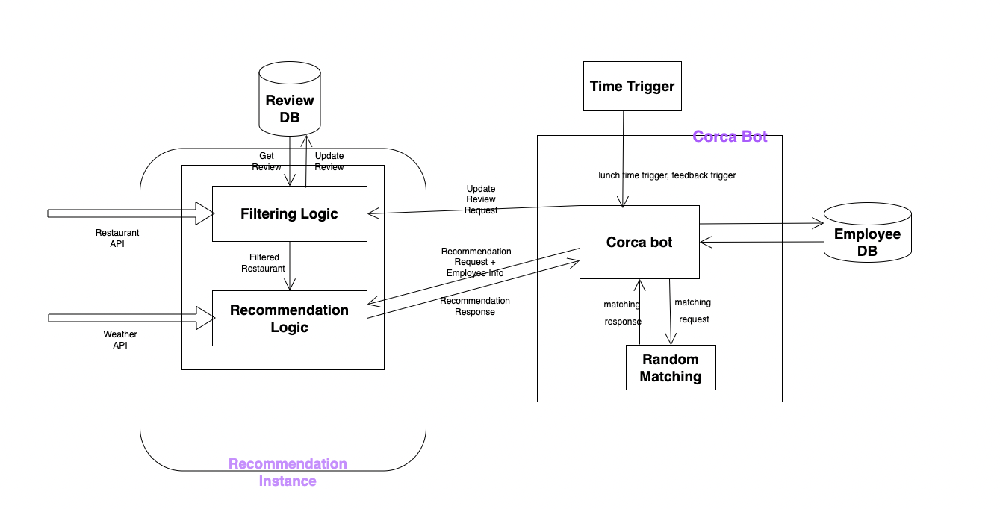

# Corca Bot Lunch Recommendation Architecture

## Components

> Weather

- 날씨 정보 API
- 기온, 강우, 습도 정보 제공

> Corca Bot

- 코르카 봇에 저장돼있는 Employee DB에서 Employee 정보 제공
- 팀 선정 기능 제공 (Random Matching)
- Time Trigger
  - 10:30 am : 코르카 봇으로 점심 식사 여부 체크 요청
  - 01:00 pm : 코르카 봇으로 점심 메뉴 추천 리뷰 요청
- 점심 식사에 참여하는 팀별 Emplyoee 정보와 점심 메뉴 추천 요청을 Event Bus로 전달 (Event driven MSA)

> Random Recommendation

- 각각의 랜덤 추천 instance는 로드밸런싱을 통해 요청 수에 따라 scale in, scale out 이 가능하다.

  > > Restaurant Recommendation Logic

  - 팀원 정보와 날씨를 바탕으로 적절한 메뉴 추천

  - 점심 메뉴 추천 요청이 들어오면, API를 통해 넘어온 음식점에 맞게 Review DB 데이터를 가져온다.

  > > Filtering Logic

  - Restaurant DB를 거리순으로, 리뷰를 바탕으로 필터링한다.
  - 각 Restaurant 별 어울리는 날씨 매칭 필터링 존재

> Review DB

- Restaurant 별 리뷰 정보 저장

## Description

