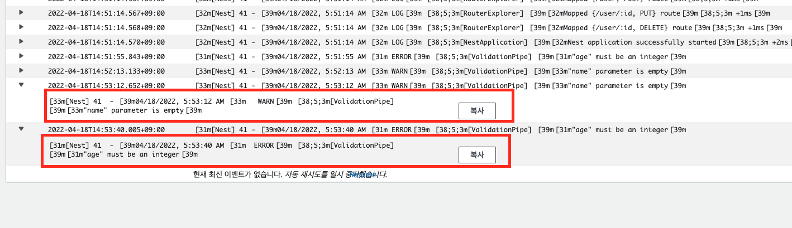

# Monitoring

## Logging

`PUT /user/:id`

아래 요청을 보내는 상황

1. { "age" : 21 } : log message 출력
2. { "name" : "hello", "age" : "21"} : error message 출력

---

## CloudWatch Dashboard

### Application ELB

- RequestCount
- RejectedConnectionCount
- NewConnectionCount

### ECS

[AWS ECS CloudWatch Metrics](https://docs.aws.amazon.com/ko_kr/AmazonECS/latest/developerguide/cloudwatch-metrics.html)

- CPU, Memory Utilization
- ML model instance : GPU Reservation

### EBS

[AWS EBS CloudWatch Metrics](https://docs.aws.amazon.com/ko_kr/AWSEC2/latest/UserGuide/using_cloudwatch_ebs.html)

- VolumeReadOps
- VolumeWriteOps

### RDS

[AWS RDS CloudWatch Metrics](https://docs.aws.amazon.com/ko_kr/AmazonRDS/latest/UserGuide/rds-metrics.html)

- Read, Write Latency, IOps, Throughput
