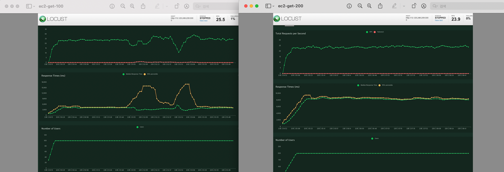
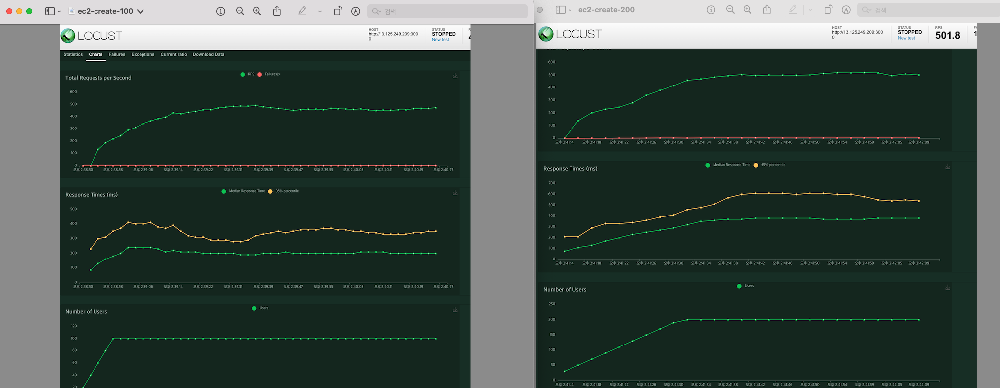
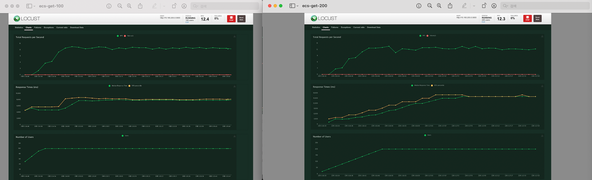
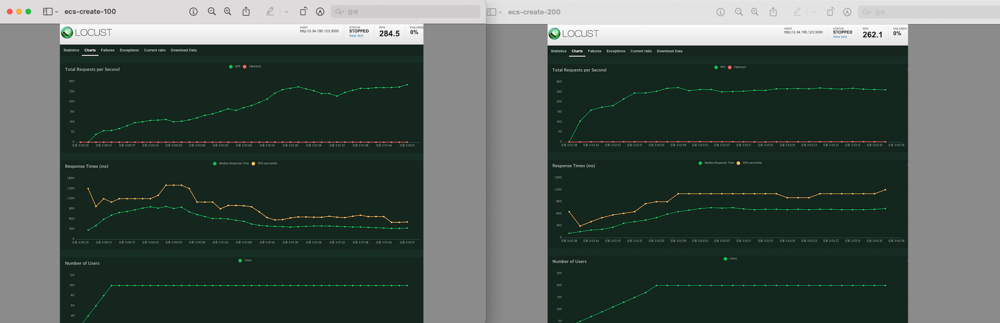

# Locust Testing

| Type     | 최대 동시 접속자 수 | 응답 시간 측정 | 단위시간당 최대 처리량 |
| -------- | ------------------- | -------------- | ---------------------- |
| EC2-get  | 100/200             | 4000/8000      | 25.5/23.9              |
| EC2-post | 100/200             | 200/350        | 500/500                |
| ECS-get  | 100/200             | 8000/16000     | 12.4/12.3              |
| ECS-post | 100/200             | 400/600        | 284.5/262.1            |

 

## EC2

### 1. EC2 ( GET /user ) Performance

---

- 응답시간은 사용자 수에 비례하여 증가.
- 왜 동시접속자수 100명일때만 response time 급증 현상?
- RPS는 비슷하게 유지 : `postgres or typeorm 작업처리량 한계?.`

### 2. EC2 ( POST /user ) Performance

---

- read 작업보다 response time이 짧은 이유는 user 데이터가 많아서 read 작업이 write보다 오래 걸리기 떄문인 것 같다.
- RPS는 비슷하게 유지 : `postgres or typeorm 작업처리량 한계?`
     

## ECS

### 1. ECS ( GET /user ) Performance

---

- EC2처럼 동시 접속자 수와 무관하게 RPS 결과 나옴 -> `postgres or typeorm 작업처리량 한계?`
- EC2에 비해 응답시간, RPS 결과가 저조함. -> `EC2 인스턴스와 ECS의 하드웨어 성능 비교`

### 2. ECS ( POST /user ) Performance

---

- EC2에 비해 응답시간, RPS 결과가 저조함. -> `EC2 인스턴스와 ECS의 하드웨어 성능 비교`

   

---

## Failure가 거의 안일어나면서 일정하게 유지되는 Response time

- `typeorm 기능 찾아보기`
